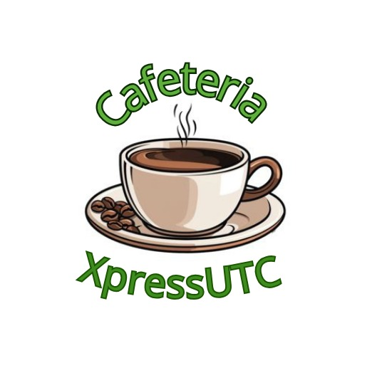

<p align="center">
  
</p>

# XpressUTC

Sistema de gestión integral para la cafetería de la Universidad Tecnológica de Coahuila (UTC), diseñado para agilizar procesos de pedidos, mejorar la experiencia de estudiantes y personal administrativo, y ofrecer visibilidad en tiempo real de servicios universitarios.

## 📋 Tabla de Contenidos

- [Visión General](#visión-general)
- [Características Principales](#características-principales)
- [Módulos del Sistema](#módulos-del-sistema)
- [Arquitectura Tecnológica](#arquitectura-tecnológica)
- [Guía de Instalación](#guía-de-instalación)
- [Estructura del Proyecto](#estructura-del-proyecto)
- [Componentes Clave](#componentes-clave)
- [Optimizaciones Implementadas](#optimizaciones-implementadas)
- [Estrategia de Testing](#estrategia-de-testing)
- [Configuración y Variables de Entorno](#configuración-y-variables-de-entorno)
- [Colaboración](#colaboración)

## 🎯 Visión General

**XpressUTC** es una plataforma web moderna que centraliza los servicios de la cafetería universitaria, permitiendo a estudiantes y personal realizar pedidos en línea, gestionar su carrito de compras, realizar pagos y hacer seguimiento de sus órdenes.

### Objetivos Principales

- **Centralización de servicios**: Unificar los servicios de cafetería en una sola plataforma accesible
- **Experiencia de usuario mejorada**: Interfaz intuitiva con diseño responsive y tema oscuro
- **Gestión eficiente**: Sistema de carrito, checkout y seguimiento de órdenes en tiempo real
- **Seguridad y validación**: Autenticación robusta con validaciones adaptadas a perfiles universitarios

### Estado Actual

✅ **Prototipo funcional** con:
- Sistema completo de autenticación (registro, login, recuperación de contraseña)
- Gestión de productos y categorías
- Carrito de compras con persistencia
- Proceso de checkout simplificado
- Historial de órdenes
- Dashboard personalizado por rol
- Optimizaciones de rendimiento

## ✨ Características Principales

### 🔐 Autenticación y Seguridad

- **Registro de usuarios** con validación de correos institucionales:
  - Estudiantes: `matricula@alumno.utc.edu.mx` (8 dígitos)
  - Profesores: `correo@maestros.utc.edu.mx`
  - Personal: `correo@utc.edu.mx`
- **Validación robusta** con Zod (frontend) y reglas personalizadas (backend)
- **Sesiones seguras** con timeout automático por inactividad
- **Recuperación de contraseña** con tokens seguros
- **Verificación de email** (opcional)

### 🛒 E-commerce

- **Catálogo de productos** organizado por categorías
- **Carrito de compras** persistente (sesión y usuario autenticado)
- **Checkout simplificado** con validación de tarjeta (prototipo)
- **Historial de órdenes** con detalles completos
- **Gestión de inventario** (backend)

### 🎨 Interfaz de Usuario

- **Tema oscuro** consistente en toda la aplicación
- **Diseño responsive** para móviles, tablets y desktop
- **Componentes reutilizables** (Modales, LazyImage, Layouts)
- **Feedback visual** con toasts y mensajes de error claros
- **Accesibilidad** con ARIA labels y navegación por teclado

### ⚡ Optimizaciones

- **Lazy loading de imágenes** con IntersectionObserver
- **Caché de imágenes** (cliente y servidor)
- **Code splitting** optimizado para React
- **Bundle optimization** con manual chunks en Vite

## 📦 Módulos del Sistema

### 1. Autenticación (`/auth`)
- Registro de usuarios (`/register`)
- Inicio de sesión (`/login`)
- Recuperación de contraseña (`/forgot-password`, `/reset-password`)
- Verificación de email (`/verify-email`)

### 2. Menú de Productos (`/menu`)
- Visualización de productos por categorías
- Búsqueda y filtrado
- Emojis dinámicos por categoría/producto
- Agregar productos al carrito

### 3. Carrito de Compras (`/cart`)
- Gestión de items en el carrito
- Actualización de cantidades
- Eliminación de productos
- Vaciar carrito completo
- Timer de expiración del carrito

### 4. Checkout (`/checkout`)
- Resumen del pedido
- Formulario de pago simplificado
- Validación de tarjeta (prototipo)
- Confirmación de orden

### 5. Órdenes (`/orders`)
- Historial de pedidos
- Detalles de cada orden
- Estado de las órdenes
- Página de confirmación

### 6. Dashboard (`/dashboard`)
- Panel principal personalizado
- Accesos rápidos a módulos
- Métricas básicas (según rol)
- Navegación contextual

### 7. Perfil de Usuario (`/profile`)
- Edición de información personal
- Cambio de contraseña
- Eliminación de cuenta

### 8. Contacto (`/contact`) ⚠️
- **Estado**: Oculto temporalmente (rutas comentadas)
- Formulario de contacto (no disponible actualmente)
- Envío de mensajes por email (pendiente de activación)

## 🏗️ Arquitectura Tecnológica

### Backend

- **Framework**: Laravel 11
- **API**: RESTful con Inertia.js para SPA
- **Base de datos**: MySQL (configurable)
- **Autenticación**: Laravel Breeze
- **Validación**: Form Requests + Reglas personalizadas
- **Email**: Laravel Mail (SMTP configurable)

### Frontend

- **Framework**: React 18
- **Routing**: Inertia.js (SPA sin API tradicional)
- **Build Tool**: Vite
- **Estilos**: Tailwind CSS
- **Validación**: Zod
- **Notificaciones**: React Toastify
- **Iconos**: React Icons

### Herramientas de Desarrollo

- **PHP**: 8.2+
- **Node.js**: 18+
- **Composer**: Gestión de dependencias PHP
- **NPM**: Gestión de dependencias JavaScript
- **Docker**: Laravel Sail (opcional)

### Testing

- **Backend**: PHPUnit, Pest
- **Frontend**: Jest (configurable)
- **E2E**: Laravel Dusk / Playwright (recomendado)

## 🚀 Guía de Instalación

### Requisitos Previos

- PHP 8.2 o superior
- Composer
- Node.js 18+ y NPM
- MySQL 8.0+ (o compatible)
- Git

### Pasos de Instalación

1. **Clonar el repositorio**
   ```bash
   git clone <repository-url>
   cd XpressUTC
   ```

2. **Instalar dependencias PHP**
   ```bash
   composer install
   ```

3. **Instalar dependencias JavaScript**
   ```bash
   npm install
   ```

4. **Configurar entorno**
   ```bash
   cp .env.example .env
   php artisan key:generate
   ```

5. **Configurar base de datos**
   Editar `.env` con tus credenciales:
   ```env
   DB_CONNECTION=mysql
   DB_HOST=127.0.0.1
   DB_PORT=3306
   DB_DATABASE=xpressutc
   DB_USERNAME=tu_usuario
   DB_PASSWORD=tu_contraseña
   ```

6. **Ejecutar migraciones y seeders**
   ```bash
   php artisan migrate --seed
   ```

7. **Compilar assets**
   
   **Para desarrollo** (requiere dos terminales):
   
   Terminal 1 - Servidor de desarrollo Vite:
   ```bash
   npm run dev
   ```
   
   Terminal 2 - Servidor Laravel:
   ```bash
   php artisan serve
   ```
   
   **Para producción**:
   ```bash
   npm run build
   php artisan serve
   ```
   
   Acceder a: `http://127.0.0.1:8000`
   
   > **Nota**: En desarrollo, `npm run dev` debe ejecutarse en paralelo con `php artisan serve` para que Vite compile los assets en tiempo real.

### Usando Laravel Sail (Docker)

```bash
./vendor/bin/sail up -d
./vendor/bin/sail composer install
./vendor/bin/sail npm install
./vendor/bin/sail artisan key:generate
./vendor/bin/sail artisan migrate --seed
./vendor/bin/sail npm run dev
```

## 📁 Estructura del Proyecto

```
XpressUTC/
├── app/
│   ├── Http/
│   │   ├── Controllers/
│   │   │   ├── Api/          # Controladores API REST
│   │   │   ├── Auth/         # Controladores de autenticación
│   │   │   └── ...           # Controladores web
│   │   ├── Middleware/       # Middleware personalizado
│   │   └── Requests/         # Form Requests (validación)
│   ├── Models/               # Modelos Eloquent
│   ├── Rules/                # Reglas de validación personalizadas
│   └── Services/             # Servicios de negocio
├── database/
│   ├── migrations/            # Migraciones de base de datos
│   └── seeders/              # Seeders para datos iniciales
├── public/
│   ├── images/               # Imágenes estáticas
│   │   └── xpressutc-logo1.jpeg
│   └── .htaccess             # Configuración Apache
├── resources/
│   ├── js/
│   │   ├── Components/       # Componentes React reutilizables
│   │   │   ├── LazyImage.jsx
│   │   │   ├── ConfirmModal.jsx
│   │   │   └── ...
│   │   ├── Layouts/          # Layouts de página
│   │   │   ├── AuthenticatedLayout.jsx
│   │   │   └── GuestLayout.jsx
│   │   ├── Pages/            # Páginas de la aplicación
│   │   │   ├── Auth/
│   │   │   ├── Menu.jsx
│   │   │   ├── Cart.jsx
│   │   │   ├── Checkout.jsx
│   │   │   └── ...
│   │   ├── hooks/            # Custom hooks
│   │   │   └── useSessionTimeout.js
│   │   ├── validations/      # Schemas de validación Zod
│   │   │   └── authSchemas.js
│   │   └── app.jsx           # Punto de entrada
│   ├── css/                  # Estilos CSS
│   │   ├── app.css
│   │   └── dashboard.css
│   └── views/
│       ├── emails/           # Plantillas de email
│       └── app.blade.php     # Template principal
├── routes/
│   ├── web.php               # Rutas web
│   ├── api.php                # Rutas API
│   └── auth.php               # Rutas de autenticación
├── vite.config.js            # Configuración de Vite
├── tailwind.config.js        # Configuración de Tailwind
└── package.json              # Dependencias NPM
```

## 🧩 Componentes Clave

### LazyImage
Componente para carga diferida de imágenes con IntersectionObserver y caché en memoria.

```jsx
<LazyImage
    src="/images/producto.jpg"
    alt="Producto"
    className="w-full h-full object-cover"
/>
```

### ConfirmModal
Modal de confirmación personalizado con variantes (default, danger, warning).

```jsx
const { showConfirm, confirm } = useConfirmModal();

showConfirm({
    title: 'Eliminar producto',
    message: '¿Estás seguro?',
    variant: 'danger',
    onConfirm: () => { /* acción */ }
});
```

### useSessionTimeout
Hook personalizado para manejar timeout de sesión por inactividad.

```jsx
const { sessionWarning } = useSessionTimeout(120); // 120 minutos
```

## ⚙️ Optimizaciones Implementadas

### 1. Lazy Loading de Imágenes
- Implementado con `IntersectionObserver`
- Caché en memoria para evitar recargas
- Placeholder mientras carga

### 2. Caché de Imágenes
- **Cliente**: Caché en memoria con `Set`
- **Servidor**: Headers de caché en `.htaccess` (1 año para imágenes)

### 3. Code Splitting
- Separación de vendors en chunks:
  - `vendor-react`: React y dependencias directas
  - `vendor-inertia`: Inertia.js
  - `vendor-zod`: Zod
  - `vendor-toastify`: React Toastify
  - `vendor-icons`: React Icons
  - `vendor-other`: Otras dependencias

### 4. Bundle Optimization
- `manualChunks` configurado en Vite
- Prevención de errores de inicialización de React
- CSS code splitting habilitado

## 🧪 Estrategia de Testing

### Cobertura de Funcionalidades

- ✅ Autenticación (registro, login, recuperación de contraseña)
- ✅ Gestión de perfiles y estados de usuario
- ✅ Flujo de carrito y checkout
- ✅ Gestión de órdenes
- ✅ Visualización de panel y métricas por rol

### Tipos de Pruebas

#### Pruebas Unitarias
- PHPUnit/Pest para validar controladores, servicios y políticas
- Simulación de reglas de negocio con factories y seeders
- Validación de schemas Zod en frontend

#### Pruebas de Integración
- Validación de endpoints REST y respuestas JSON
- Verificación de interacciones entre módulos
- Pruebas de flujos completos (carrito → checkout → orden)

#### Pruebas End-to-End
- Playwright (recomendado) o Laravel Dusk
- Escenarios críticos:
  - Registro y login
  - Agregar productos al carrito
  - Proceso de checkout
  - Visualización de órdenes

### Reportes y Cobertura

```bash
# Backend
php artisan test --coverage

# Frontend (cuando esté configurado)
npm run test:coverage

# E2E
npm run test:e2e
```

**Meta inicial**: ≥70% cobertura del backend y ≥60% en interacciones UI críticas.

## 🔧 Configuración y Variables de Entorno

### Variables Importantes en `.env`

```env
# Aplicación
APP_NAME=XpressUTC
APP_ENV=local
APP_DEBUG=true
APP_URL=http://127.0.0.1:8000

# Base de datos
DB_CONNECTION=mysql
DB_HOST=127.0.0.1
DB_PORT=3306
DB_DATABASE=xpressutc
DB_USERNAME=root
DB_PASSWORD=

# Email (configuración general - formulario de contacto actualmente deshabilitado)
MAIL_MAILER=smtp
MAIL_HOST=smtp.mailtrap.io
MAIL_PORT=2525
MAIL_USERNAME=null
MAIL_PASSWORD=null
MAIL_ENCRYPTION=null
MAIL_FROM_ADDRESS=noreply@xpressutc.edu.mx
MAIL_FROM_NAME="${APP_NAME}"

# Sesión
SESSION_DRIVER=file
SESSION_LIFETIME=120  # minutos
```

## 🤝 Colaboración

### Antes de Contribuir

1. Revisa los lineamientos internos del proyecto
2. Crea una rama desde `main` para tu feature
3. Asegúrate de que los tests pasen

### Pull Requests

- Incluye descripción clara de los cambios
- Añade capturas o GIFs cuando modifiques la interfaz
- Actualiza la documentación si es necesario
- Añade o actualiza pruebas correspondientes

### Reportar Issues

- Utiliza la plantilla de issues
- Incluye pasos para reproducir
- Adjunta logs relevantes
- Especifica versión de PHP, Node.js y sistema operativo

## 📝 Licencia

Este proyecto es propiedad de la Universidad Tecnológica de Coahuila.

## 👥 Equipo

Desarrollado para la comunidad UTC con ❤️

---

**Nota**: Este es un prototipo funcional. Para producción, asegúrate de:
- Configurar correctamente las variables de entorno
- Implementar integración real de pagos (Conekta/PayPal)
- Configurar servidor de producción con HTTPS
- Implementar monitoreo y logging
- Realizar auditoría de seguridad
